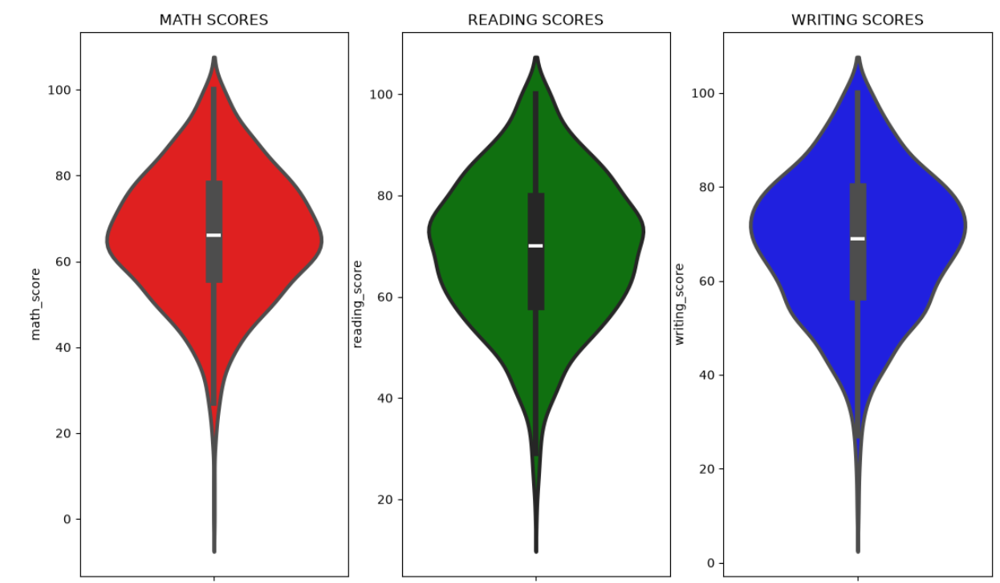
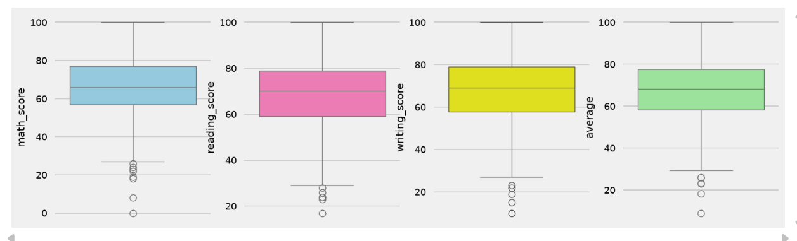
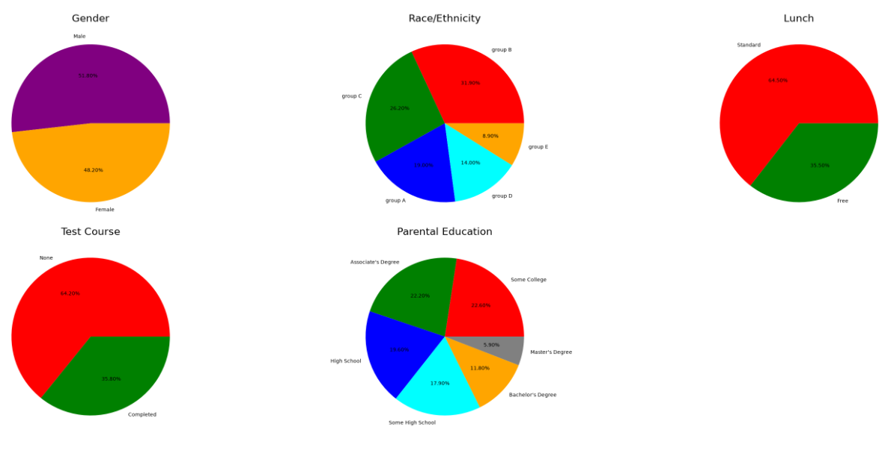
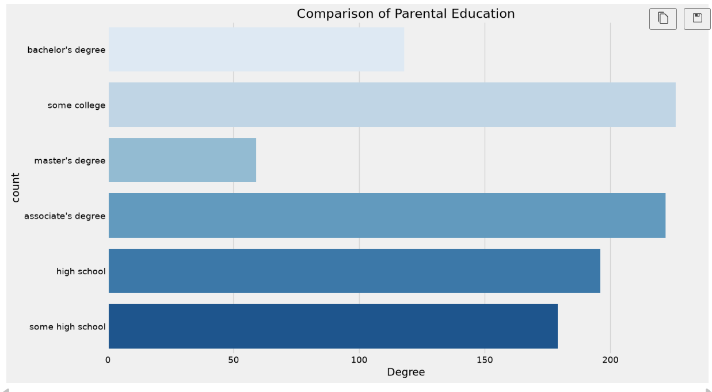
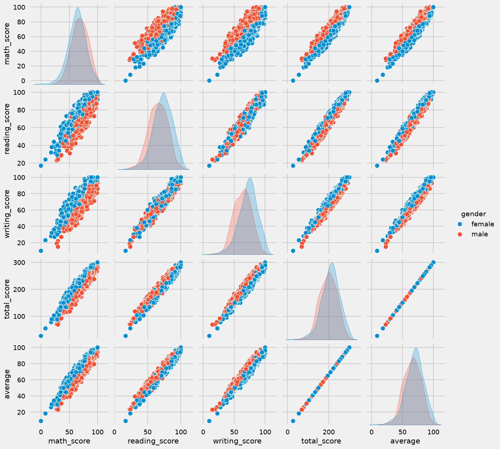
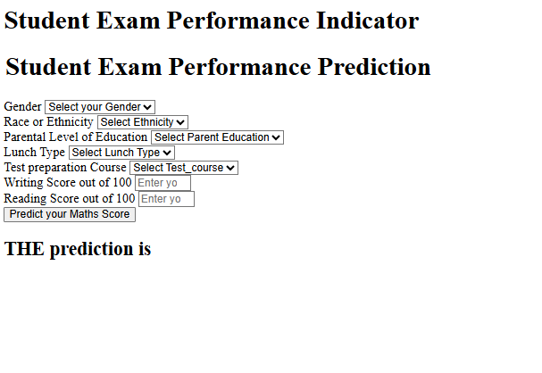
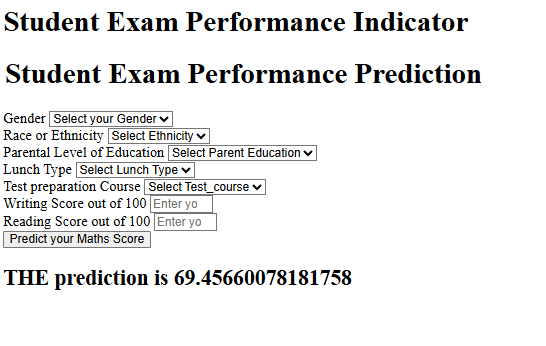
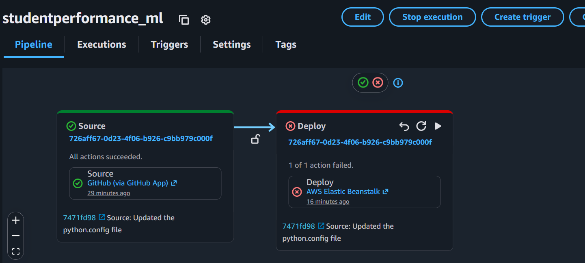
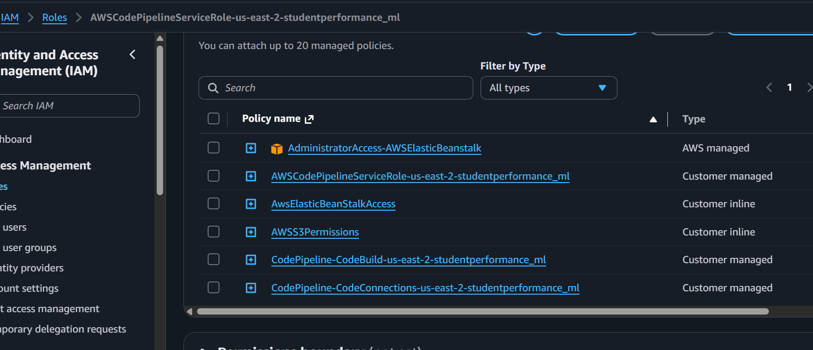
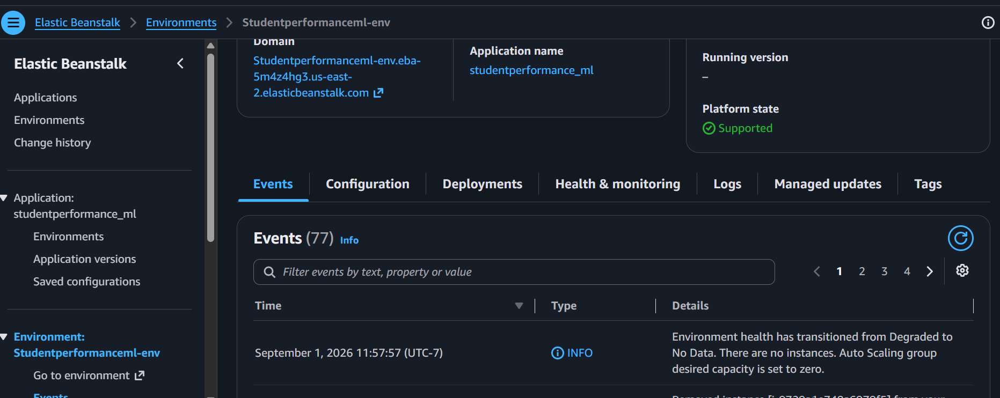

# Student Exam Performance Predictor — End-to-End ML Project

An end-to-end machine learning project that predicts a student's **math score** from their demographic details and their reading/writing scores. It covers the full lifecycle — data ingestion, preprocessing, model selection via hyperparameter search, and deployment — packaged as an installable Python module and served through a Flask web app, deployed on **AWS Elastic Beanstalk** via **AWS CodePipeline**.

---

## Table of Contents

- [Overview](#overview)
- [Architecture](#architecture)
- [Project Structure](#project-structure)
- [Tech Stack](#tech-stack)
- [Dataset](#dataset)
- [Model Performance](#model-performance)
- [Exploratory Data Analysis](#exploratory-data-analysis)
- [Setup & Installation](#setup--installation)
- [Usage](#usage)
  - [Exploring the Notebooks](#exploring-the-notebooks)
  - [Running the Training Pipeline](#running-the-training-pipeline)
  - [Running the Web App](#running-the-web-app)
- [Web App Routes](#web-app-routes)
- [Deployment (AWS)](#deployment-aws)
- [Deployment Screenshots](#deployment-screenshots)
- [Code Reference](#code-reference)
- [Known Issues / TODO](#known-issues--todo)
- [Future Improvements](#future-improvements)
- [Author](#author)

---

## Overview

This project trains a regression model that predicts a student's **math score** based on:
- Gender
- Race/ethnicity
- Parental level of education
- Lunch type (standard / free-or-reduced)
- Test preparation course completion
- Reading score
- Writing score

Several regression models (Linear Regression, Random Forest, Decision Tree, Gradient Boosting, XGBoost, CatBoost, AdaBoost) are trained and compared via `GridSearchCV`, and the best-performing one is saved and served through a simple Flask form where a user can enter a student's details and get a predicted math score back.

---

## Architecture

```
notebook/data/stud.csv (raw dataset)
        │
        ▼
 ┌────────────────────┐
 │   Data Ingestion    │  → reads raw CSV, saves artifacts/data.csv,
 │ (data_ingestion.py) │    splits into artifacts/train.csv + test.csv
 └────────────────────┘
        │
        ▼
 ┌─────────────────────────┐
 │  Data Transformation     │ → builds a ColumnTransformer:
 │ (data_transformation.py) │   numeric (median impute + scale) +
 │                          │   categorical (mode impute + one-hot + scale)
 └─────────────────────────┘
        │  saves artifacts/preprocessor.pkl
        ▼
 ┌────────────────────┐
 │   Model Trainer      │ → trains 8 candidate regressors with GridSearchCV,
 │ (model_trainer.py)   │   picks the best by R² score
 └────────────────────┘
        │  saves artifacts/model.pkl
        ▼
 ┌───────────────────────────┐
 │   Predict Pipeline         │ → loads model.pkl + preprocessor.pkl,
 │ (predict_pipeline.py)      │   transforms new input, returns prediction
 └───────────────────────────┘
        │
        ▼
   Flask app (application.py) → "/" and "/predictdata"
        │
        ▼
   AWS CodePipeline → AWS Elastic Beanstalk (production hosting)
```

Each pipeline stage follows the same pattern: a `@dataclass`-based `*Config` class defines file paths, and the corresponding class (`DataIngestion`, `DataTransformation`, `ModelTrainer`) does the work and raises a custom `CustomException` (with file name + line number) on failure.

---

## Project Structure

```
ml_project/
├── application.py                    # Flask app entry point (routes: "/" and "/predictdata")
├── setup.py                          # Packaging config — installs `src` as the `mlproject` package
├── requirements.txt                  # Python dependencies
├── README.md
├── .gitignore
├── .ebextensions/
│   └── python.config                 # AWS Elastic Beanstalk config (WSGI path, pip install options)
│
├── artifacts/                        # Generated pipeline outputs (local run artifacts)
│   ├── data.csv                      # Full raw dataset copy
│   ├── train.csv / test.csv          # Train/test split
│   ├── preprocessor.pkl              # Fitted ColumnTransformer
│   └── model.pkl                     # Best trained regressor
│
├── notebook/
│   ├── 1_EDA_Student_Performance.ipynb   # Exploratory data analysis
│   ├── 2_Model_Training.ipynb            # Model experimentation notebook
│   ├── data/
│   │   └── stud.csv                      # Source dataset (1000 rows)
│   └── catboost_info/                    # CatBoost training logs/artifacts (auto-generated)
│
├── src/
│   ├── __init__.py
│   ├── exception.py                  # CustomException — wraps sys.exc_info() for file/line-level errors
│   ├── logger.py                     # Timestamped log file setup under logs/
│   ├── utils.py                      # save_object, load_object, evaluate_model (GridSearchCV loop)
│   ├── components/
│   │   ├── __init__.py
│   │   ├── data_ingestion.py         # DataIngestion, DataIngestionConfig
│   │   ├── data_transformation.py    # DataTransformation, DataTransformationConfig
│   │   └── model_trainer.py          # ModelTrainer, ModelTrainerConfig
│   └── pipeline/
│       ├── __init__.py
│       └── predict_pipeline.py       # PredictPipeline, CustomData
│
├── templates/
│   ├── index.html                    # Landing page ("Welcome to the homepage")
│   └── home.html                     # Prediction form + result display
│
├── logs/                             # Timestamped .log files, one per run
│
└── images/
    ├── studentperformance_pipeline.png   # AWS CodePipeline run (Source → Deploy)
    ├── iam_screenshot.png                # IAM role & policies used by CodePipeline
    └── elasticbean_ss.png                # Elastic Beanstalk environment dashboard
```

---

## Tech Stack

| Category | Tools |
|---|---|
| Language | Python 3.11 |
| Data processing | pandas, numpy |
| Visualization (notebooks) | seaborn |
| ML | scikit-learn, XGBoost, CatBoost |
| Serialization | dill |
| Web framework | Flask |
| Packaging | setuptools |
| Hosting | AWS Elastic Beanstalk |
| CI/CD | AWS CodePipeline (GitHub App source → Elastic Beanstalk deploy) |
| IAM | Custom service role with CodePipeline/CodeBuild/CodeConnections/S3/Elastic Beanstalk permissions |

---

## Dataset

`notebook/data/stud.csv` — 1,000 student records with the following columns:

| Column | Type | Description |
|---|---|---|
| `gender` | categorical | male / female |
| `race_ethnicity` | categorical | group A–E |
| `parental_level_of_education` | categorical | e.g. bachelor's degree, some college, high school |
| `lunch` | categorical | standard / free-or-reduced |
| `test_preparation_course` | categorical | none / completed |
| `math_score` | numeric | **target variable** |
| `reading_score` | numeric | feature |
| `writing_score` | numeric | feature |

Exploratory analysis lives in `notebook/1_EDA_Student_Performance.ipynb`, and model experimentation/comparison lives in `notebook/2_Model_Training.ipynb`.

---
## Model Performance

After running the training pipeline (with the `evaluate_model()` early-return bug fixed), here's how each candidate regressor scored on R² against the held-out test set:

| Model | R² Score |
|---|---|
| **Linear Regression** | **0.8804** |
| Gradient Boosting | 0.8720 |
| AdaBoost Regressor | 0.8552 |
| CatBoosting Regression | 0.8524 |
| Random Forest | 0.8488 |
| XGB Regressor | 0.8231 |
| Decision Tree | 0.7519 |

**Linear Regression came out on top**, ahead of every ensemble model — suggesting the relationship between the input features and math score in this dataset is largely linear/additive rather than needing complex non-linear interactions. `ModelTrainer` selects and saves whichever model scores highest (here, Linear Regression) as `artifacts/model.pkl`.

---
## Exploratory Data Analysis
 
Charts generated during EDA (`notebook/1_EDA_Student_Performance.ipynb`), illustrating the dataset before modeling:
 
**Score distributions** — math, reading, and writing scores are all roughly bell-shaped and centered in the 60s–70s, with a handful of low-score outliers:
 

 
**Outlier check** — boxplots of math, reading, writing, and average scores confirm a small number of low-end outliers per subject (visible as individual points below the whiskers), with no extreme high-end outliers:
 

 
**Categorical breakdown** — distribution of students by gender, race/ethnicity, lunch type, test preparation course, and parental education level:
 

 
**Parental education levels** — "some college" and "associate's degree" are the most common categories, "master's degree" the least:
 

 
**Pairwise relationships** — math, reading, writing, total, and average scores are all strongly positively correlated with each other (as expected, since total/average are derived from the other three), shown split by gender:
 

 
---
## Setup & Installation

### 1. Clone the repository
```bash
git clone <repo-url>
cd <repo-folder>
```

### 2. Create a virtual environment
```bash
conda create -p venv python==3.11 -y
conda activate venv/     
```

### 3. Install dependencies
```bash
pip install -r requirements.txt
```
`requirements.txt` ends with a commented-out `#-e .`. To install the local `src` package  in editable mode so `from src...` imports work project-wide, either uncomment that line or run:
```bash
pip install -e .
```

---

## Usage

### Exploring the Notebooks
```bash
jupyter notebook notebook/1_EDA_Student_Performance.ipynb
jupyter notebook notebook/2_Model_Training.ipynb
```
These contain the exploratory data analysis and the original model comparison work that the `src/components/` pipeline scripts formalize into reusable code.


### Running the Training Pipeline
The three pipeline stages are implemented as classes, but are wired together only in a commented-out block at the bottom of `data_ingestion.py`. To run the full pipeline end-to-end, use that block as a starting point — e.g. from the project root:
```python
from src.components.data_ingestion import DataIngestion
from src.components.data_transformation import DataTransformation
from src.components.model_trainer import ModelTrainer

train_data, test_data = DataIngestion().intiate_data_ingestion()
train_arr, test_arr, _ = DataTransformation().initiate_data_transformation(train_data, test_data)
r2_score = ModelTrainer().intiate_model_trainer(train_arr, test_arr)
print(r2_score)
```
This will:
1. **Data Ingestion** — read `notebook/data/stud.csv`, save a copy to `artifacts/data.csv`, and split it 80/20 into `artifacts/train.csv` and `artifacts/test.csv`.
2. **Data Transformation** — build and fit a `ColumnTransformer` (numeric: median-impute + scale; categorical: mode-impute + one-hot encode + scale), save it to `artifacts/preprocessor.pkl`.
3. **Model Trainer** — run `GridSearchCV` across 8 candidate regressors, evaluate by R² score, save the best model to `artifacts/model.pkl`, and return its test R² score.

### Running the Web App
```bash
python application.py
```
This starts a Flask server on `http://0.0.0.0:5000` (Flask's default port). Visit `http://localhost:5000/predictdata` to use the prediction form.

---

## Web App Routes

| Method | Route | Description |
|---|---|---|
| `GET` | `/` | Renders `index.html` — a simple landing page |
| `GET` | `/predictdata` | Renders `home.html` — the prediction input form |
| `POST` | `/predictdata` | Reads form fields into a `CustomData` object, runs `PredictPipeline.predict()`, and re-renders `home.html` with the predicted math score |

The form collects: gender, race/ethnicity, parental education, lunch type, test preparation course, and reading/writing scores.

**The prediction form**, before submission:
 

 
**After submission**, showing the predicted math score:
 


---


## Deployment (AWS)

The app is deployed on **AWS Elastic Beanstalk**, with deployments automated through **AWS CodePipeline**:

- **Source stage** — pulls from GitHub via the GitHub App integration, triggered on push.
- **Deploy stage** — deploys the built app to an Elastic Beanstalk environment (`Studentperformanceml-env`, application `studentperformance_ml`).
- **`.ebextensions/python.config`** configures the Elastic Beanstalk Python platform:
  ```yaml
  option_settings:
    aws:elasticbeanstalk:container:python:
      WSGIPath: application:application
    aws:elasticbeanstalk:application:environment:
      PIP_OPTIONS: "--only-binary=:all: --no-cache-dir --default-timeout=120"
  ```
  `WSGIPath: application:application` tells Elastic Beanstalk's WSGI server to import the `application` object from `application.py` (Flask's `app = application` aliasing in that file supports both names). The `PIP_OPTIONS` setting forces binary-only wheel installs to avoid slow/failing source builds for packages like `scikit-learn`, `xgboost`, and `catboost` in the Beanstalk build environment.
- **IAM** — a dedicated service role (`AWSCodePipelineServiceRole-us-east-2-studentperformance_ml`) is attached with managed/customer policies covering Elastic Beanstalk administration, CodeBuild, CodeConnections (GitHub integration), and S3 (artifact storage for the pipeline).
> **Instance size issue:** Deploying to Elastic Beanstalk on a **t3.micro** (free-tier) instance failed — `xgboost` and `catboost` are memory/compute-heavy at install and import time, and t3.micro's limited RAM wasn't sufficient for the environment to come up healthy. A larger instance type (e.g. `t3.small` or above) is needed for this app to deploy successfully with the full model stack. This is also reflected in the Elastic Beanstalk screenshot below, where the environment shows zero running instances.
---

## Deployment Screenshots

**CodePipeline run** — Source (GitHub) → Deploy (Elastic Beanstalk):



**IAM role & attached policies** for the CodePipeline service role:



**Elastic Beanstalk environment dashboard**:



---

## Code Reference

### `application.py`
Flask entry point.
- `app = application` — both names point to the same Flask instance, which is what lets `.ebextensions/python.config`'s `WSGIPath: application:application` resolve correctly.
- `GET /` → renders `index.html`.
- `GET /predictdata` → renders the empty form (`home.html`).
- `POST /predictdata` → builds a `CustomData` object from form fields, converts it to a DataFrame via `get_data_as_data_frame()`, and runs it through `PredictPipeline().predict()`. 
- Runs via `app.run(host='0.0.0.0')` under `if __name__=='__main__':` (only used for local dev — Elastic Beanstalk uses its own WSGI server in production).

### `src/exception.py`
- `error_message_details(error, error_detail: sys)` pulls the failing file name and line number from `sys.exc_info()`'s traceback object.
- `CustomException` wraps any exception with this detail and overrides `__str__` so `print(e)` or logging shows the enriched message.

### `src/logger.py`
- Creates one timestamped log file per run under `logs/` (format `MM_DD_YYYY_HH_MM_SS`) and configures `logging.basicConfig` to write to it at `INFO` level.

### `src/utils.py`
- `save_object(file_path, obj)` / `load_object(file_path)` — pickle (via `dill`) a Python object to/from disk, creating parent directories as needed.
- `evaluate_model(X_train, y_train, X_test, y_test, models, params)` — loops over each model, runs `GridSearchCV(model, param, cv=3)`, refits the model with the best params found, and scores it with R² on the test set. **The `return report` statement is indented inside the `for` loop**, so it currently returns after evaluating only the *first* model in the `models` dict rather than all of them.

### `src/components/data_ingestion.py`
- `DataIngestionConfig` (dataclass) defines `train_data_path`, `test_data_path`, `raw_data_path`, all under `artifacts/`.
- `DataIngestion.intiate_data_ingestion()` reads `notebook\data\stud.csv`, saves a raw copy, does an 80/20 `train_test_split(random_state=42)`, and writes both splits to CSV.
- A commented-out `if __name__ == '__main__':` block at the bottom shows the intended full-pipeline run (ingestion → transformation → training) — currently inactive.

### `src/components/data_transformation.py`
- `get_data_transformer_obj()` builds a `ColumnTransformer` with:
  - Numeric pipeline (`writing_score`, `reading_score`): `SimpleImputer(strategy='median')` → `StandardScaler()`
  - Categorical pipeline (`gender`, `race_ethnicity`, `parental_level_of_education`, `lunch`, `test_preparation_course`): `SimpleImputer(strategy='most_frequent')` → `OneHotEncoder(sparse_output=False)` → `StandardScaler(with_mean=False)`
- `initiate_data_transformation(train_path, test_path)` reads the split CSVs, separates the `math_score` target column, fits/transforms the preprocessor, concatenates features + target into numpy arrays, saves `preprocessor.pkl`, and returns the transformed train/test arrays plus the preprocessor's file path.

### `src/components/model_trainer.py`
- Defines 7 candidate regressors and a matching `params` grid for `GridSearchCV`.
- **Two of the `params` dict keys don't exactly match the `models` dict keys**: `models` has `"XGB Regressor"` and `"CatBoosting Regression"`, while `params` has 
- Picks the best model by max test R² score, raises `CustomException` if the best score is below `0.6`, saves the winning model to `artifacts/model.pkl`, and returns its R² score.

### `src/pipeline/predict_pipeline.py`
- `PredictPipeline.predict(features)` loads `artifacts\model.pkl` and `artifacts\preprocessor.pkl`, transforms the input features, and returns the model's prediction.
- `CustomData` is a simple data holder that takes the individual form fields and exposes `get_data_as_data_frame()` to turn them into a single-row `pandas.DataFrame` shaped like the training data (minus the target column).

### `src/pipeline/train_pipeline.py`
Currently an empty file — presumably intended to hold the same ingestion → transformation → training orchestration that's currently only sketched out (commented-out) in `data_ingestion.py`.

---

## Known Issues / TODO
- [ ] **Elastic Beanstalk deployment fails on `t3.micro`** — `xgboost` and `catboost` are too resource-heavy (RAM/CPU) for the free-tier `t3.micro` instance type; the environment can't come up healthy and gets scaled down to zero instances. Deploying successfully requires a larger instance type (e.g. `t3.large` or above), which falls outside the AWS free tier.
- [ ] **Hardcoded Windows-style paths** (`r'notebook\data\stud.csv'` in `data_ingestion.py`, `r'artifacts\model.pkl'` / `r'artifacts\preprocessor.pkl'` in `predict_pipeline.py`) will break on Linux/macOS and inside the Elastic Beanstalk Linux runtime. Replace with `os.path.join(...)` or `pathlib.Path`.
- [ ] Add basic input validation on the Flask form (e.g. score ranges) beyond the HTML `min`/`max` attributes, since those are client-side only.

---
## Future Improvements
 
- **FastAPI backend** — migrate from Flask to FastAPI for automatic interactive docs (`/docs`), request/response validation via Pydantic models, and async support, bringing this project in line with the network security project's stack.
- **MLOps** — add experiment tracking (MLflow/DagsHub) so model comparisons across runs are persisted rather than only visible as a one-off printed dict; consider model versioning instead of always overwriting `artifacts/model.pkl`.
- **Better UI/UX** — improve the prediction form's styling and layout, show which model produced the prediction and its R² score for transparency, and add clearer input validation/error messaging beyond HTML `min`/`max` attributes.
- **Unit tests** — add tests for `data_transformation.py` (preprocessor output shape/columns) and `model_trainer.py` (confirm `evaluate_model` returns results for all candidate models), plus a CI workflow that runs them on push before the CodePipeline deploy stage.
---

## Author

**Shivangi**
📧 shivangibhat53@gmail.com